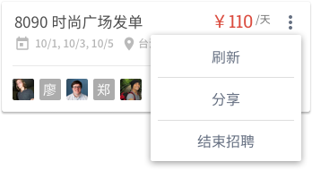

# 消息铃铛增强
## 群发岗位

### 动作入口
#### 入口一
「正在招人」tab 中岗位卡片下拉菜单。注意，为方便列表项的选择和理解，将「刷新岗位」简化为「刷新」。

#### 入口二
岗位详情页标题栏的「分享」按钮。分享弹框中新增「人才库」选项，与已有社交分享并列排放。

### 选择兼客
不支持具体兼客的勾选，默认发送给人才库中未被隐藏的所有兼客。

### 发送范围
由于雇主可随时在人才库中对兼客进行「隐藏」或「显示」操作，因此雇主打开的「人才库消息推送」页面中各条消息的发送范围不一。

## 聊天上下文

气泡间增加岗位标题条，用于提示雇主，对方报名了哪个岗位。

遵循以下规则：

- 兼客报名/抢单新岗位且向相应雇主发送消息时显示
- 每个新岗位标题条仅显示一次
- 岗位标题条对兼客雇主皆可见
