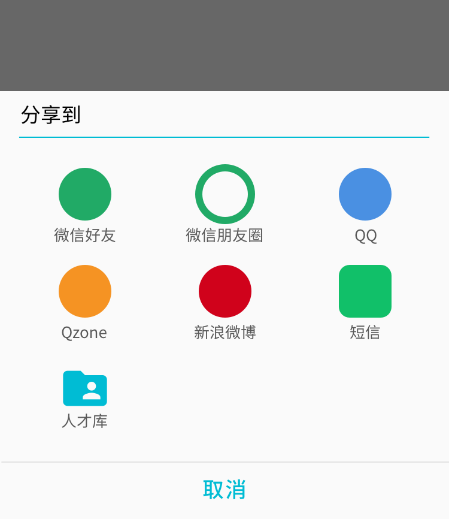
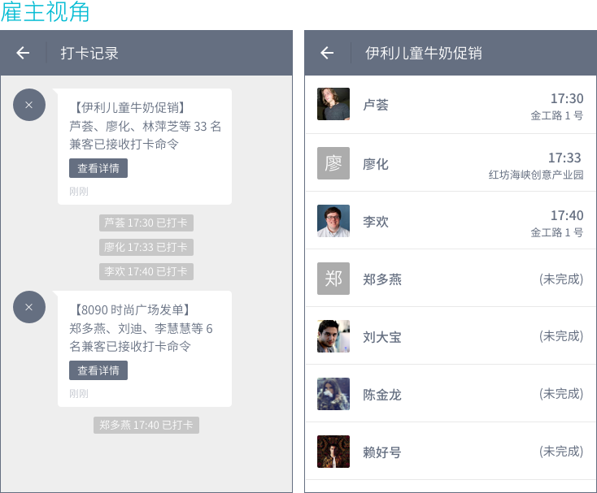

# 消息铃铛增强
## 群发岗位


### 动作入口
#### 入口一
「正在招人」tab 中岗位卡片下拉菜单。注意，为方便列表项的选择和理解，将「刷新岗位」简化为「刷新」。


#### 入口二
岗位详情页标题栏的「分享」按钮。分享弹框中新增「人才库」选项，与已有社交分享并列排放，UI 暂时不做大改。



### 选择兼客
不支持具体兼客的勾选，默认发送给人才库中未被隐藏的所有兼客。

### 发送
由于雇主可随时在人才库中对兼客进行「隐藏」或「显示」操作，因此雇主打开的「人才库消息推送」页面中各条消息的发送范围不一。

点击分享面板「人才库」选项后，弹框确认，说明文字中显示出人才库未被隐藏的前三位兼客姓名及接收总数：

```
【标题】推送给人才库
【说明】芦荟、廖化、林萍芝等 33 名兼客将收到您的岗位推送。点击确定，立即发送。
【按钮】取消 | 确定
```

限制雇主每天最多发送 6 条人才库消息推送。第 7 次起尝试推送岗位时弹框：

```
【标题】推送次数过多
【说明】目前支持您每天最多发 6 条岗位推送。
【按钮】知道了
```

### 接收
兼客端在与雇主的对聊页中接收消息。

--------------------
注：「人才库消息推送」对聊页不显示文本框。

## 聊天上下文


气泡间增加岗位标题条，用于提示雇主，对方报名了哪个岗位。

遵循以下规则：

- 兼客报名/抢单新岗位且向相应雇主发送消息时显示
- 每个新岗位标题条仅显示一次
- 岗位标题条对兼客雇主皆可见

## 打卡记录


雇主每发出一条打卡命令，则「打卡记录」页中多出一个消息气泡。点击消息中「查看详情」跳转至详情页，页面标题使用岗位标题，以列表呈现打卡结果。

1. 消息气泡间夹杂出现以信息条呈现的兼客打卡时间。消息气泡（发送时间点）与信息条（打卡行为发生时间点）依据时间排序。
2. 详情页列表项分为两类：已完成及未完成。已完成类列表项右侧显示打卡时间及打卡位置。未完成类列表项右侧显示`(未完成)`
3. 列表项排序规则：已完成兼客在前，最先打卡兼客在前；未完成兼客在后，按录用时间排序，最先录用在前。
