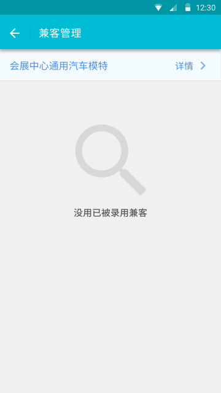
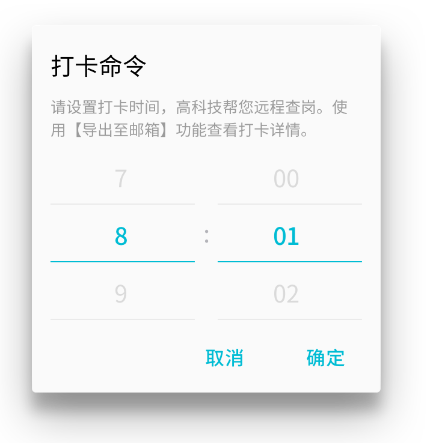
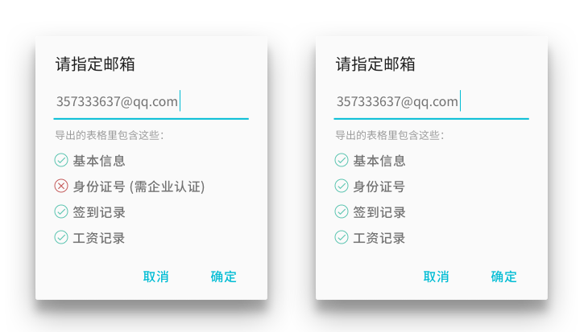

# 雇主端服务

2.0 中标题栏可选动作「全部完工」被替换为图标，点击后出现下拉列表，内含「全部完工」「打卡命令」「导出至邮箱」等选项。


当兼客管理页中没有兼客时，隐藏在线支付、标题栏可选动作、群发等按钮。



## 打卡命令
帮助雇主远程查岗。点击「打卡命令」弹框要求输入打卡时间。点击「发送」后，该岗位中已被录用兼客将立即收到系统以雇主身份发来的 IM 消息。

```
【标题】打卡命令
【说明】请设置规定打卡时间，高科技帮您远程查岗。使用【导出至邮箱】功能查看打卡记录表格。
【时间控件】8 : 01
【按钮】取消 | 确定
```



### 发送条件
- 工作时间段（6:00~22:00）内。
- 每天每个岗位最多发送 6 次。

用完后继续尝试点击「打卡命令」弹框提示：

```
【标题】发送次数过多
【说明】目前支持您每天最多发 6 条打卡命令。
【按钮】知道了
```

非工作时间段点击「打卡命令」弹框提示：

```
【标题】无法发出打卡命令
【说明】请在正常时间段（6:00~22:00）内发送打卡命令。
【按钮】知道了
```

### 接收条件
雇主只能对需要打卡的人发打卡命令：

- 报名/抢单该岗位的兼客上岗日期与要求打卡日期重合。
- 尚未被雇主处理过的兼客——雇主没给点完工或未到岗。

如果页面内所有兼客均不符合以上条件，此时雇主无法发送打卡命令给任何兼客，点击「打卡命令」应弹框提醒：

```
【标题】无法发出打卡命令
【说明】咦？今天似乎没有需要上岗的兼客。
【按钮】知道了
```

### 兼客打卡


兼客在命令发送当天点击「立即打卡」则弹框：

```
【标题】确认打卡
【第 1 行说明】位置：红坊海峡创意产业园
【第 2 行说明】时间：2015 10/1 9:35
【按钮】取消 | 确定
```

点击「确定」完成打卡，在打卡命令中显示结果：

```
【打卡提醒】打卡时间: 19:00
请在雇主指定工作地点打卡。
——————————
位置：红坊海峡创意产业园
时间：2015 10/1 9:35
```


- **已过期**：若命令已失效（仅发送当天有效）则按钮文本换为「已过期」且被置灰，不可点击。
- **已完成**：点击弹框中的「确定」后按钮变换为「已完成」。该操作对雇主及兼客均不作特殊提醒。定位不准带来的偏差由雇主人工判断。系统规则中打卡时间与薪资计算不挂钩。

--------------------
注：

1. 不在对聊页中通知雇主打卡结果。统一通过功能号「打卡记录」查看。
2. 页面中的兼客列表都被处理过时，「全部完工」不可操作，直接在下拉列表中移除。

## 导出至邮箱


[下载示例文件](https://attachments.tower.im/tower/255aa3215c20447bb852305c4cbf8329?download=true&filename=%E3%80%908090+%E6%97%B6%E5%B0%9A%E5%B9%BF%E5%9C%BA%E5%8F%91%E5%8D%95%E3%80%91%E5%85%BC%E5%AE%A2%E8%AF%A6%E6%83%85.xlsx)

把兼客基本信息、身份证号、打卡记录、工资记录等导出并发送至指定邮箱。点击「导出至邮箱」未认证和已认证营业执照，弹框分别为：



可重复操作，暂不限制发送次数。需记忆雇主历史设置，一名雇主对应一个邮箱，修改后则覆盖历史邮箱设置。打开弹框后，文本框中默认填写上次设置的邮箱。需验证邮箱格式，但不验证邮箱地址是否真实或是否归属于雇主本人。

--------------------
注：雇主信息中不含「邮箱」字段。暂不添加。

### 邮件格式
标题：【${岗位标题}】兼客详情

正文：由 [兼客兼职](http://jianke.cc) 发送。（如果这不是您申请发送的邮件，请忽视）

```
（直接在此展示附件表格内容，方便雇主快速查阅）
```


附件：【${岗位标题}】兼客详情.csv

## 人才库
雇主手动点击「完工」或逾期系统处理为完工的兼客将被加入雇主人才库。

### 页面入口
雇主个人中心：

- 雇主信息
- ***人才库**
- 吐槽冲我来

### 人才管理


点击「删除」后将该兼客折叠到「已删除」中，点击「已删除」展开其中兼客，点击「显示」再次回到显示列表的底部。默认按添加时间排序列表，后添加兼客在上。此类操作无须弹框确认。

点击列表项进入「兼客名片」，此处兼客名片标题栏中有「电话联系」及「IM 对聊」两个动作。

### 简介
人才库页标题栏含一个动作：「简介」。点击后弹框：

```
【标题】人才库简介
【说明】您录用并确认完工的兼客都会被添加进来。点击【删除】对兼客做进一步筛选，被删除的兼客可以在页面末尾被找回。
【按钮】取消 | 确定
```

当前版本中，人才库主要使用场景为：雇主群发岗位。人才库中所含兼客与雇主形成过至少一次良好的雇佣关系，双方互相信任（相对而言）。
