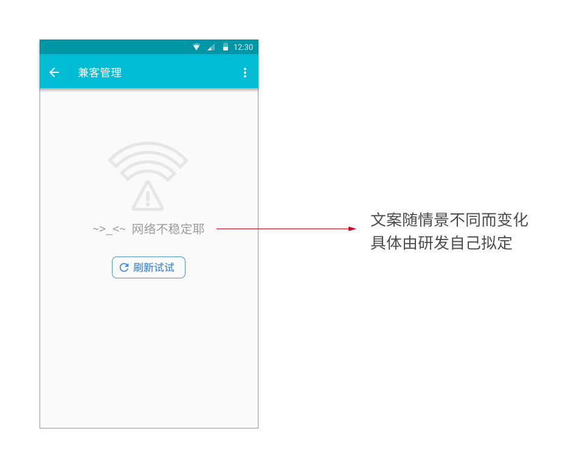
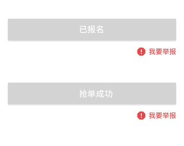

# 若干优化
## 新建岗位权限
### 未实名认证上限
对未完成实名认证的雇主，限制最多发布 3 条岗位（抢单或普通兼职合计）。

- 未认证雇主第 1 次发布

```
欢迎发岗位
您还剩 3 次发布机会。完成实名认证后可以获得更多权限！
立即认证 | 知道了
```

- 未认证雇主第 2 次发布

```
欢迎发岗位
您还剩 2 次发布机会。完成实名认证后可以获得更多权限！
立即认证 | 知道了
```

- 未认证雇主第 3 次发布

```
欢迎发岗位
您还剩 1 次发布机会。完成实名认证后可以获得更多权限！
立即认证 | 知道了
```

- 未认证雇主第 4 次发布

```
权限不足
您已经用完了免认证发布机会。为了营造安全的兼职环境，请在成功通过实名认证后再发岗位。
立即认证 | 知道了
```

点击【立即认证】跳转至「实名认证」页；点击【知道了】关闭弹框，并从「新建岗位」页返回至上一页。
### 每日上限
对已完成实名认证的雇主，限制一天最多发布 7 条岗位（抢单或普通兼职合计）。

- 已认证雇主当天第 8 次发布

```
每日上限
抱歉，您今天发布了 7 条岗位，已达到平台处理负担上限。我们一定不断努力满足忠实用户的要求！
知道了
```

点击【知道了】关闭弹框，并从「新建岗位」页返回至上一页。

--------------------
注：弹框统一在打开「新建岗位」页后出现。同步修改 2.0 文档中提及的该页面的弹框。

## 身份证号使用声明


「实名认证」页中新增提示（不区分兼客或雇主）：

```
由于正规企业的财务要求，您的身份证号可能开放给雇主，用于提供薪资支付凭证。
```

## 短信规则优化
提高雇主处理简历及时率，同时不过度干扰。

### 即将释放
由于 24 小时自动释放岗位机制，部分雇主可能因疏忽错失人才。在即将释放名额时发短信再次督促雇主进行录用操作：

- 截止时间点在 9:00~22:00 内（通用工作时间段）：提前 2 小时发送
- 截止时间点在零点前：统一次日 21:00 发送
- 截止时间点在零点后：统一当日 21:00 发送

短信文案如下：

```
您还剩最后 2 小时，再不录用她就走人啦！马上处理 → ${smsUrl}
```

--------------------
注：移除 → 报名 6 小时未处理短信提醒。

### 引导关闭
岗位每增加一名兼客报名/抢单时，系统会对雇主发出短信提醒。部分可能提前满足用工需求，不想继续招人，此时应引导雇主使用「结束招聘」以关闭岗位提醒。

```
兼客报名（内部岗位）：
报告老板，有人报名参加 10/7, 10/8 的兼职！您就收了她吧 → ${smsUrl} （您有 24 小时处理时间。如已招满，请打开链接找到【结束招聘】）

兼客报名（外来岗位）：
报告老板！有人报名【${jobTitle}】10/7, 10/8 的兼职，您就收了她吧 → ${smsUrl} （您有 24 小时处理时间。如已招满，请打开链接找到【结束招聘】）
```

--------------------
注：短信中新增信息「报名日期」。例如，日期离散则直接显示 10/7, 10/8, 10/12, 10/14；日期连续则显示 10/7 至 10/14。

## 新增状态提示


对服务器异常情况作更友好的提示。点击【刷新试试】再次尝试获取数据。错误信息类型不在此归纳，由研发同学拟定。

## 便捷举报


已报名/抢单成功后，岗位详情页中，在报名/抢单按钮附近新增「我要举报」按钮用于举报雇主。点击后弹框内容与「待办事项」页中「有问题？」一致。
